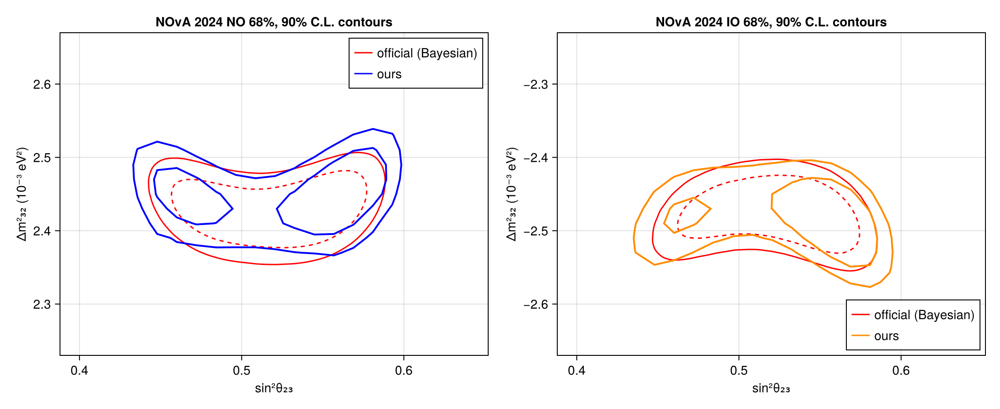
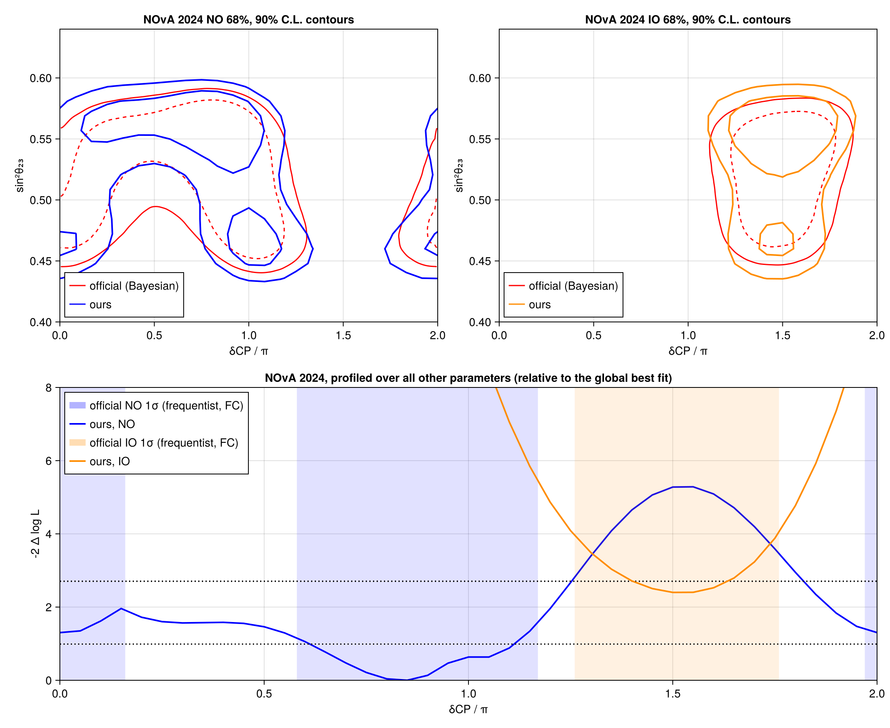
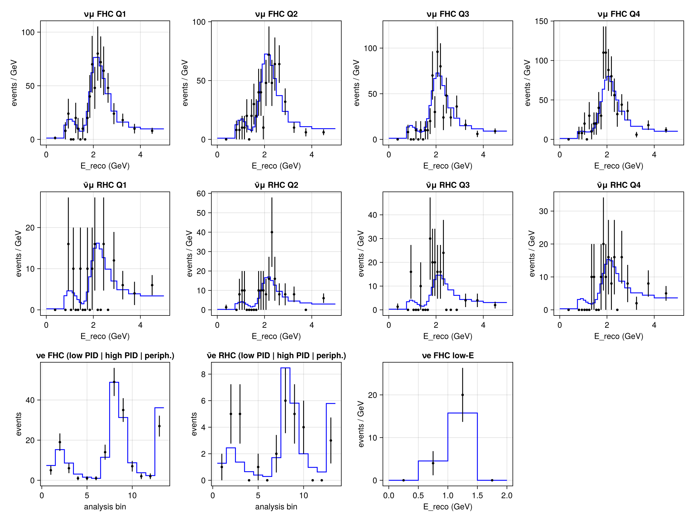

# NOvA 2024 (26.61E20 ν + 12.5E20 ν̄ POT)
 ## Resources
data source: NOvA 2024 official data release, https://doi.org/10.5281/zenodo.17822358 (FERMILAB-DATA-2025-05),
analysis: NOvA Collaboration, Phys. Rev. Lett. 136, 011802 (2026), arXiv:2509.04361.
The ROOT files were converted once to `NOvA_2024_data_release.h5` with `convert_nova_2024_to_hdf5.py`.

## Test output plots

## Meta Information
- **task**: profile
- **date**: 2026-10-01 16:02:36
- **vars_to_scan**: OrderedDict(:θ₂₃ => 21, :Δm²₃₁ => 21)
- **username**: peller
- **repo_clean**: false
- **exec_time**: 21.581490993499756
- **repo**: /mnt/c/Users/peller/work/claude/Newtrinos.jl
- **hostname**: flippy
- **params**: (nova_hadronic_energy_scale = 1.0, nova_muon_energy_scale = 1.0, nova_nue_bkg_norm = 1.0, nova_nue_signal_norm = 1.0, nova_nue_xsec_ratio_nu = 1.0, nova_nue_xsec_ratio_nubar = 1.0, nova_numu_norm = 1.0, nova_rhc_hadronic_energy_scale = 1.0, nova_rhc_norm = 1.0, Δm²₂₁ = 7.53e-5, Δm²₃₁ = 0.0025163, δCP = 2.73318560862312, θ₁₂ = 0.5872495604379192, θ₁₃ = 0.14801178045127827, θ₂₃ = 0.8556288707523761)
- **package_version**: 0.1.1
- **cache_dir**: test_cache_ref2024_NO_th23dm31
- **priors**: (nova_hadronic_energy_scale = Truncated(Normal{Float64}(μ=1.0, σ=0.025); lower=0.9, upper=1.1), nova_muon_energy_scale = Truncated(Normal{Float64}(μ=1.0, σ=0.005); lower=0.97, upper=1.03), nova_nue_bkg_norm = Normal{Float64}(μ=1.0, σ=0.1), nova_nue_signal_norm = Normal{Float64}(μ=1.0, σ=0.04), nova_nue_xsec_ratio_nu = Normal{Float64}(μ=1.0, σ=0.02), nova_nue_xsec_ratio_nubar = Normal{Float64}(μ=1.0, σ=0.02), nova_numu_norm = Normal{Float64}(μ=1.0, σ=0.035), nova_rhc_hadronic_energy_scale = Truncated(Normal{Float64}(μ=1.0, σ=0.01); lower=0.95, upper=1.05), nova_rhc_norm = Normal{Float64}(μ=1.0, σ=0.03), Δm²₂₁ = 7.53e-5, Δm²₃₁ = Uniform{Float64}(a=0.0023252999999999998, b=0.0027253), δCP = Uniform{Float64}(a=0.0, b=6.283185307179586), θ₁₂ = 0.5872495604379192, θ₁₃ = Normal{Float64}(μ=0.14801178045127827, σ=0.0021503029788008943), θ₂₃ = Uniform{Float64}(a=0.684719203002283, b=0.9272952180016123))
- **commit_hash**: caab6d023152a0589f935c7a195c531ab91c6526
