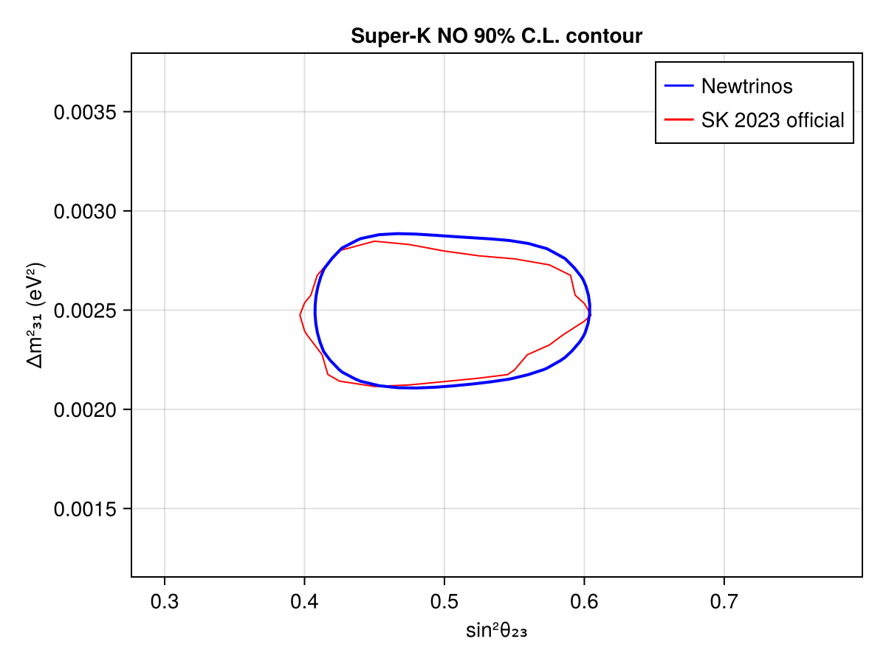
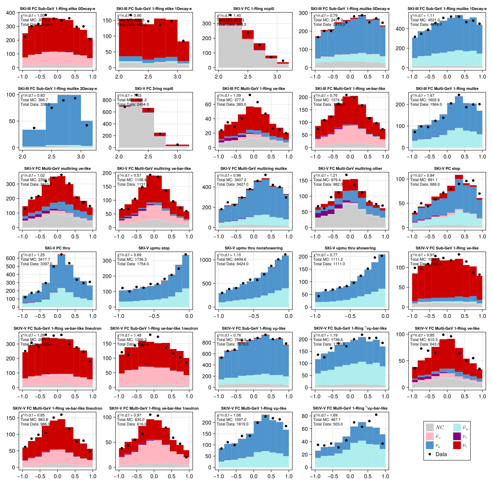

# Super-Kamiokande I-V Atmospheric Neutrino Analysis
 ## Resources
data source: Super-K I-V atmospheric neutrino data release, DOI: 10.5281/zenodo.8401262
Associated publication: "Atmospheric neutrino oscillation analysis with neutron tagging
and an expanded fiducial volume in Super-Kamiokande I-V"

## Test output plots

## Meta Information
- **exec_time**: 35513.140375852585 s
- **date**: 2026-08-13 20:41:33
- **commit_hash**: d61f19f1eace83b6fea52ac356d12eed88e20d2f
