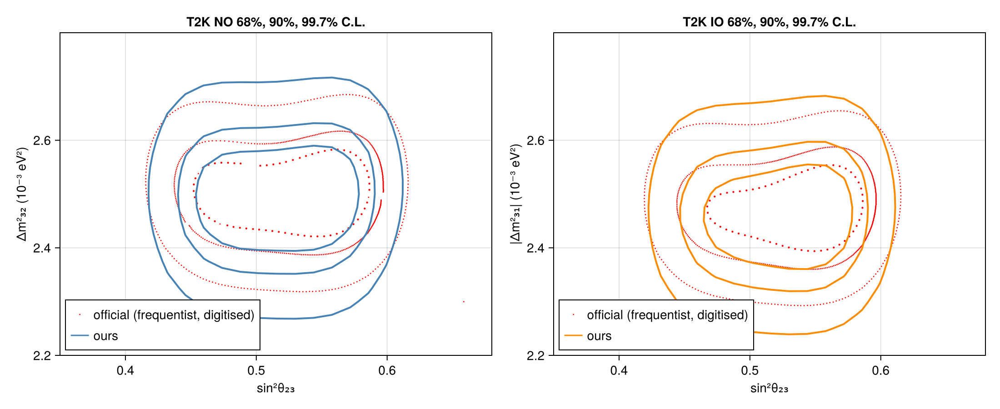
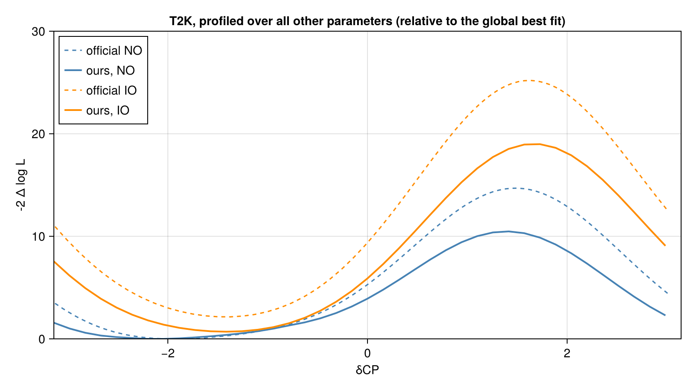
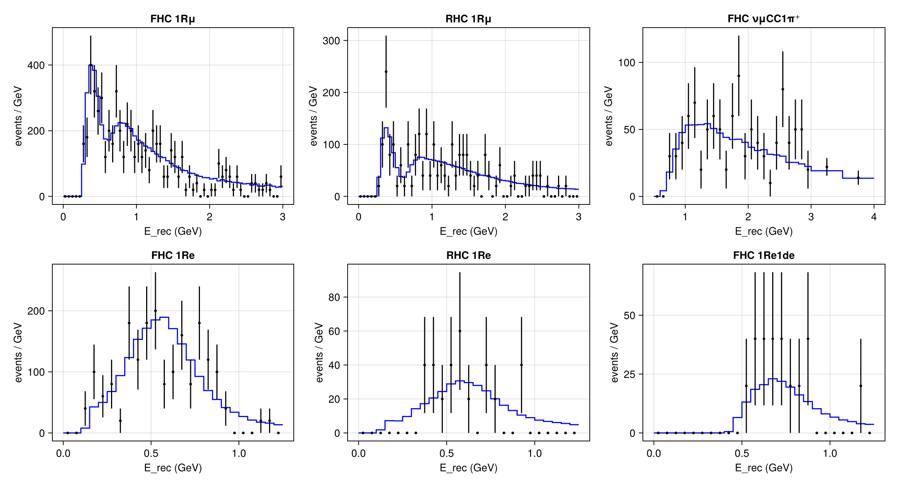

# T2K (19.7E20 ν + 16.3E20 ν̄ POT)
 ## Resources
analysis: T2K Collaboration, arXiv:2506.05889 (2025); data: arXiv:2303.03222 (same exposure);
far-detector predictions: T2K data release, https://doi.org/10.5281/zenodo.15701867 (CC-BY 4.0).
All inputs were extracted from the vector PDFs (official contours of Fig. 4: digitised from a raster
image) into `T2K_2025.h5` with the scripts in `extraction/`.

## Test output plots

## Meta Information
- **task**: profile
- **date**: 2026-10-01 16:43:20
- **vars_to_scan**: OrderedDict(:θ₂₃ => 25, :Δm²₃₁ => 25)
- **username**: peller
- **repo_clean**: false
- **exec_time**: 69.22328996658325
- **repo**: /mnt/c/Users/peller/work/claude/Newtrinos.jl
- **hostname**: flippy
- **params**: (t2k_cc1pi_norm = 1.0, t2k_energy_scale = 1.0, t2k_fhc1re1de_norm = 1.0, t2k_fhc1re_norm = 1.0, t2k_fhc1rmu_norm = 1.0, t2k_flux_xsec_norm = 1.0, t2k_nc_norm = 1.0, t2k_nonqe_norm = 1.0, t2k_nue_xsec_ratio_nu = 1.0, t2k_nue_xsec_ratio_nubar = 1.0, t2k_rhc1re_norm = 1.0, t2k_rhc1rmu_norm = 1.0, t2k_rhc_norm = 1.0, Δm²₂₁ = 7.53e-5, Δm²₃₁ = 0.0025813, δCP = 4.1031853071795865, θ₁₂ = 0.5872523687443223, θ₁₃ = 0.14887328003763659, θ₂₃ = 0.8455431045948424)
- **package_version**: 0.1.1
- **cache_dir**: test_cache_NO_th23dm31
- **priors**: (t2k_cc1pi_norm = Normal{Float64}(μ=1.0, σ=0.035), t2k_energy_scale = Truncated(Normal{Float64}(μ=1.0, σ=0.02); lower=0.9, upper=1.1), t2k_fhc1re1de_norm = Normal{Float64}(μ=1.0, σ=0.134), t2k_fhc1re_norm = Normal{Float64}(μ=1.0, σ=0.031), t2k_fhc1rmu_norm = Normal{Float64}(μ=1.0, σ=0.021), t2k_flux_xsec_norm = Normal{Float64}(μ=1.0, σ=0.025), t2k_nc_norm = Normal{Float64}(μ=1.0, σ=0.3), t2k_nonqe_norm = Normal{Float64}(μ=1.0, σ=0.1), t2k_nue_xsec_ratio_nu = Normal{Float64}(μ=1.0, σ=0.03), t2k_nue_xsec_ratio_nubar = Normal{Float64}(μ=1.0, σ=0.03), t2k_rhc1re_norm = Normal{Float64}(μ=1.0, σ=0.039), t2k_rhc1rmu_norm = Normal{Float64}(μ=1.0, σ=0.019), t2k_rhc_norm = Normal{Float64}(μ=1.0, σ=0.025), Δm²₂₁ = 7.53e-5, Δm²₃₁ = Uniform{Float64}(a=0.0022753, b=0.0028753), δCP = Uniform{Float64}(a=0.0, b=6.283185307179586), θ₁₂ = 0.5872523687443223, θ₁₃ = Normal{Float64}(μ=0.14887328003763659, σ=0.002386092504892402), θ₂₃ = Uniform{Float64}(a=0.6330518363897495, b=0.9695321101157683))
- **commit_hash**: e126685bf4b23e309e6da4c55263899346db1a2a
